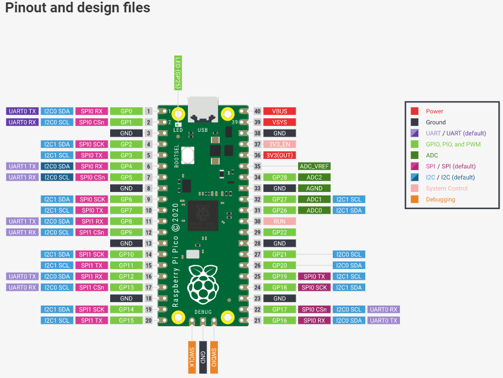

# お部屋を大人から守ろう！

## はじめに
はじめまして。ゆくらさんです。  
今回は、Rasberry Pi Picoを使って「扉を開けたら警報が鳴る」ようにしていきたいと思います。  

---
## 計画
1. フローチャート図を作成する
1. ラズパイで実験する
1. 2.で作ったコードをPico用に書き換える
1. ハード面の実装をする（はんだ付け・かしめ等）

---
## フローチャート図を作成する
出来上がったものがこちらになります

---
## Razberry Pi で動かすためのコード

警報をならそうと思ったのですが、家にアクティブブザーとパッシブブザーがありました。
検討に検討を重ねた結果、電源を入れるだけで音が鳴るアクティブブザーを使用することにしました。

出来上がったものがこちらになります

door.py
~~~Python
import time
import RPi.GPIO as GPIO

GPIO.setmode(GPIO.BCM)

GPIO.setup(18, GPIO.IN, pull_up_down=GPIO.PUD_UP) #reed switch

# tact switch
GPIO.setup(17, GPIO.IN, pull_up_down=GPIO.PUD_UP) #A
GPIO.setup(27, GPIO.IN, pull_up_down=GPIO.PUD_UP) #B
GPIO.setup(22, GPIO.IN, pull_up_down=GPIO.PUD_UP) #C

GPIO.setup(5, GPIO.OUT) #buzzer

while True:
    while True:
        GPIO.output(5,0)
        if GPIO.wait_for_edge(17,GPIO.FALLING) != 0:
            GPIO.wait_for_edge(18,GPIO.RISING)
            print("OPEN!")
            if GPIO.wait_for_edge(22, GPIO.FALLING, timeout=60000, bouncetime=1000) != 0 :
                print("SAFE")
                break        
            else:
                print("OUT")
                GPIO.output(5, 1)
                time.sleep(5) 
                break

        elif GPIO.wait_for_edge(27,GPIO.FALLING) != 0:
            time.sleep(30)
            break
        else:
            print("wait now...")

~~~

---
## Razberry Pi pico でも動くように書き換える

[Rasberry Pi picoの公式ページ](https://www.raspberrypi.com/documentation/microcontrollers/raspberry-pi-pico.html#pinout-and-design-files)

Printを使うと動作が変だったので、動作確認にはPrintではなくLEDを使用しました。
ラズパイでした動作とまったく同じことができなかったので少し妥協してます。

door-pico.py
~~~Python
import utime #pico用time
from machine import Pin

###青20　黄色19　赤18

Door = Pin(10, Pin.IN, Pin.PULL_UP) #reed switch

# tact switch
TactSwA = Pin(11, Pin.IN, Pin.PULL_UP) #A
TactSwB = Pin(12, Pin.IN, Pin.PULL_UP) #B
TactSwC = Pin(13, Pin.IN, Pin.PULL_UP) #C

Buzzer = Pin(14, Pin.OUT) #buzzer

#LED
Led = Pin(18, Pin.OUT)
Yel = Pin(19, Pin.OUT)
Blu = Pin(20, Pin.OUT)

while True:
    while True:
        if TactSwA.value() == 0 :
            Led.value(1)
            while True :
                if Door.value() == 0:  
                    Yel.value(1)
                    utime.sleep(10)
                    if  TactSwC.value() == 0: #私
                        Blu.value(1)
                        utime.sleep(5)
                        break        
                    else: #侵入者
                        Buzzer.value(1)
                        utime.sleep(2)
                        break
        elif TactSwB.value() == 0:
            Yel.value(1)
            utime.sleep(30)
            break
        else:
            Led.value(0)
            Yel.value(0)
            Blu.value(0)
            Buzzer.value(0)
            break
~~~

---
## 参考文献
[Raspberry Pi PicoのGPIO機能まとめ/MicroPythonでのプログラム方法](https://hellobreak.net/raspberrypi-pico-gpio-micropython-0206/)  
[Raspberry Piでスイッチ入力](https://monomonotech.jp/kurage/raspberrypi/tact_switch.html)
